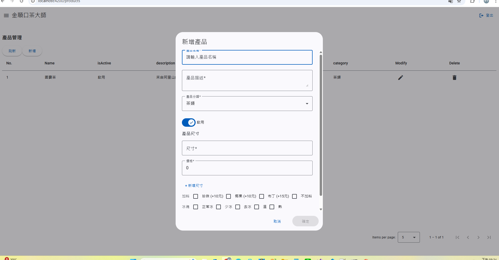

# KingstonTeaFront

本專案是使用 Angular CLI(https://github.com/angular/angular-cli) 版本 19.2.1 生成的。

## 1️⃣ 設定 API URL (`environment.ts`)

在 `src/environments/environment.ts` 內設定 **後端 API 連接 URL**，以確保前端正確連接 `TeaAPI`。

📌 **示例 (`environment.ts`)**：
```typescript
export const environment = {
  production: false,
  apiUrl: 'https://localhost:5001/api' //據後端API設定URL
};
```

## 2️⃣ 啟動開發伺服器 (`ng serve`)

執行以下指令來啟動開發伺服器，並在 `http://localhost:4200/` 開啟專案：
```sh
ng serve
```

🚀 **開發伺服器啟動後，任何對應的檔案修改都會自動重新載入！**

## 3️⃣ 登入測試帳號

當應用程式啟動後，預設會跳轉到 **Dashboard**，請使用以下測試帳號登入系統。


📌 **測試帳號**
```
帳號: a29803904
密碼: test
```

## 4️⃣ 功能列表介紹
本系統包含以下主要功能模組：

🔹 **帳號管理**
- 建立、修改、刪除、查詢使用者帳號
- 設定使用者權限與角色


🔹 **產品管理**
- 新增、編輯、刪除、查詢產品
- 設定產品分類與價格
- 管理產品規格與變體


🔹 **訂單管理**
- 建立、修改、取消、查詢訂單
- 訂單查詢與篩選
- 訂單狀態追蹤與更新


## **📌 總結**
✅ **新增 `environment.ts` 設定 API URL**，確保前端連接後端 `TeaAPI`。
✅ **提供 `production` 環境的 `environment.prod.ts` 設定**，確保正式環境使用正確的 API。
✅ **提醒開發者在 HTTP 請求中使用 `environment.apiUrl`**，避免硬編碼 API 路徑。
✅ **指導如何使用 `ng serve` 啟動開發伺服器，確保開發環境正常運作。**
✅ **提供測試帳號，方便開發者快速登入測試系統。**
✅ **新增功能列表介紹，幫助開發者了解系統核心功能。**

這樣，開發者可以正確設定 API URL，快速啟動 Angular 開發伺服器，並確保登入驗證機制與系統功能運作正常！🚀✨  
如果還有需要調整的地方，請讓我知道！😊

